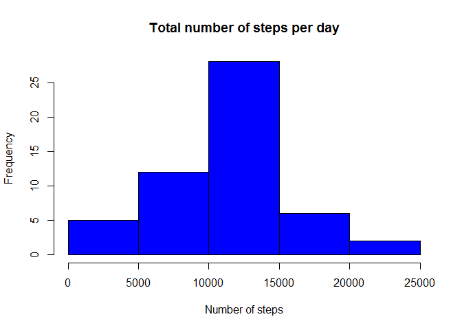
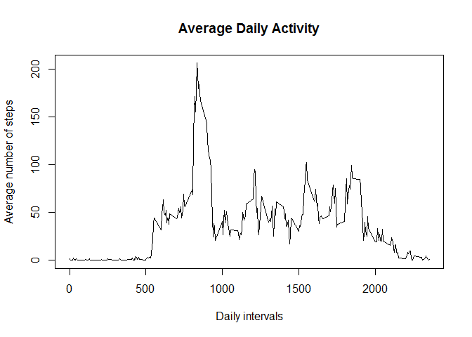
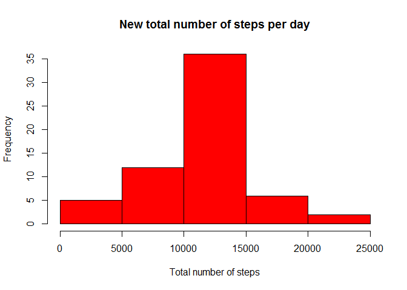

# Reproducible Research: Peer Assessment 1


###Loading and preprocessing the data

```r
#Loading the data
data <- read.csv("activity.csv", colClasses = c("numeric", "character", 
    "numeric"))
summary(data)
```

```
##      steps            date              interval     
##  Min.   :  0.00   Length:17568       Min.   :   0.0  
##  1st Qu.:  0.00   Class :character   1st Qu.: 588.8  
##  Median :  0.00   Mode  :character   Median :1177.5  
##  Mean   : 37.38                      Mean   :1177.5  
##  3rd Qu.: 12.00                      3rd Qu.:1766.2  
##  Max.   :806.00                      Max.   :2355.0  
##  NA's   :2304
```

```r
# Converting the Date
data$date <- as.Date(data$date, "%m/%d/%Y")
head(data)
```

```
##   steps       date interval
## 1    NA 2012-10-01        0
## 2    NA 2012-10-01        5
## 3    NA 2012-10-01       10
## 4    NA 2012-10-01       15
## 5    NA 2012-10-01       20
## 6    NA 2012-10-01       25
```

###What is mean total number of steps taken per day?


```r
# 1. Calculate the total number of steps taken per day
total <- aggregate(steps ~ date, data, sum, na.rm = TRUE)

# 2. Make a histogram of the total number of steps taken each day
hist(total$steps,
     xlab = "Number of steps",
     main = "Total number of steps per day",
     col = "blue")
```

<!-- -->

```r
# 3. Calculate and report the mean and median of the total number of steps taken per day
totalmean <- mean(total$steps)
totalmean
```

```
## [1] 10766.19
```

```r
totalmedian <-median(total$steps)
totalmedian
```

```
## [1] 10765
```
####The mean is 1.0766189\times 10^{4} and the median is 1.0765\times 10^{4}. 
###What is the average daily activity pattern?

```r
#Make a time series plot (i.e. type = "l") of the 5-minute interval (x-axis) and the average number of steps taken, averaged across all days (y-axis)
avg <- aggregate(steps ~ interval, data, mean, na.rm = TRUE)
plot(avg$interval, avg$steps, 
     type = "l",
     xlab = "Daily intervals",
     ylab = "Average number of steps",
     main = "Average Daily Activity")
```

<!-- -->

```r
#Which 5-minute interval, on average across all the days in the dataset, contains the maximum number of steps?
max1 <- avg[which.max(avg$steps),1]
max1
```

```
## [1] 835
```
####The 5-minute interval that contains the maximum number of steps is 835.

###Imputing missing values

```r
# 1.Calculate and report the total number of missing values in the dataset (i.e. the total number of rows with NAs)
NAS <- sum(is.na(data))
NAS
```

```
## [1] 2304
```
####The number of missing values is 2304. 


```r
# 2. Devise a strategy for filling in all of the missing values in the dataset. The strategy does not need to be sophisticated. For example, you could use the mean/median for that day, or the mean for that 5-minute interval, etc.
#Let's calculate the mean of each 5-minute interval and replace the NAs accordingly.

mean_interval <- aggregate(steps ~ interval, data, mean, na.rm = TRUE)

# 3. Create a new dataset that is equal to the original dataset but with the missing data filled in.

new_data <- data
new_data$steps[which(is.na(new_data$steps))] <- mean_interval$steps

# 4.Make a histogram of the total number of steps taken each day and Calculate and report the mean and median total number of steps taken per day. Do these values differ from the estimates from the first part of the assignment? What is the impact of imputing missing data on the estimates of the total daily number of steps?

new_total <- aggregate(steps~date, new_data, sum)
hist(new_total$steps,
     xlab = "Total number of steps",
     main = "New total number of steps per day",
     col = "red")
```

<!-- -->

```r
newmean <- mean(new_total$steps)
newmean
```

```
## [1] 10766.19
```

```r
newmedian <-median(new_total$steps)
newmedian
```

```
## [1] 10766.19
```

```r
Diffmean <- totalmean-newmean
Diffmean
```

```
## [1] 0
```

```r
Diffmedian <- totalmedian-newmedian
Diffmedian
```

```
## [1] -1.188679
```
####The new mean is 1.0766189\times 10^{4} and the new median is 1.0766189\times 10^{4}.
####The difference between the mean is 0 and the difference between the median is -1.1886792, which is not very significant.  
###Are there differences in activity patterns between weekdays and weekends?


```r
#Create a new factor variable in the dataset with two levels – “weekday” and “weekend” indicating whether a given date is a weekday or weekend day.
Day <- weekdays(as.Date(new_data$date), abbreviate = FALSE)
day_ID <- vector()
for (i in 1:nrow(new_data)) {
    if (Day[i] == "Saturday") {
        day_ID[i] <- "Weekend"
    } else if (Day[i] == "Sunday") {
        day_ID[i] <- "Weekend"
    } else {
        day_ID[i] <- "Weekday"
    }
}
new_data$day_ID <- day_ID
#Make a panel plot containing a time series plot (i.e. type = "l") of the 5-minute interval (x-axis) and the average number of steps taken, averaged across all weekday days or weekend days (y-axis). 

library(lattice)
new_avg <- aggregate(steps~interval + day_ID, new_data, mean)
xyplot(steps ~ interval | day_ID, new_avg, type = "l", layout = c(1, 2), 
    xlab = "Interval", ylab = "Number of steps")
```

<!-- -->
